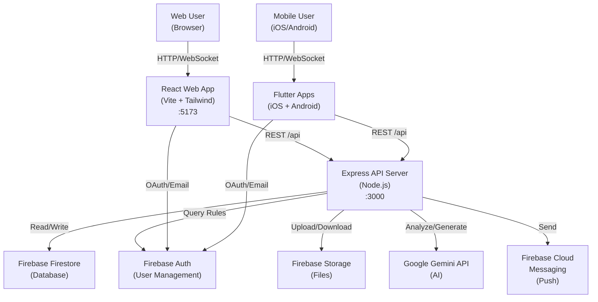

# EduFund AI — Intelligent Grant Discovery Platform

An AI-powered platform that helps students, educators, and researchers discover educational funding opportunities using natural language search and AI-powered insights powered by Google Gemini.

## Overview

**EduFund AI** solves a critical problem: finding relevant educational grants, scholarships, and funding opportunities is time-consuming and overwhelming. The platform leverages Google's Gemini AI to:

- Understand funding needs through natural language conversation
- Match users with relevant grants based on eligibility and interests
- Generate personalized application strategies and deadlines
- Provide AI-powered educational materials and guidance
- Track applications and maintain grant calendars
- Send targeted notifications about new opportunities

Target users: University students, graduates pursuing further education, educators seeking research funding, and anyone seeking international educational opportunities.

## Features

**Grant Discovery & Search**
- Natural language grant search ("Find STEM scholarships for undergraduates")
- AI-powered eligibility analysis and fit scoring
- Real-time grant database with comprehensive metadata
- Multi-filter search by country, field of study, degree level, funding amount

**AI-Powered Insights**
- Gemini API analyzes grant requirements and user eligibility
- Personalized recommendations based on user profile
- Smart deadline tracking and application scheduling

**User Dashboard**
- Saved grants collection
- Application tracking with status updates
- Calendar view for application deadlines
- Push notifications for matching opportunities
- User profile with academic and career information

**Educational Content**
- Auto-generated study guides and preparation materials
- Application tips and essay writing guidance
- Interview preparation resources
- Curated external resources and links

**Mobile & Web Support**
- Responsive web application (React)
- Native iOS and Android apps (Flutter)
- Cross-platform data synchronization via Firebase

**Administrative Features**
- Grant management and bulk import
- User statistics and analytics
- Premium features support
- Partner program management

## Tech Stack

| Layer | Technology | Purpose |
|---|---|---|
| **Frontend (Web)** | React 18, TypeScript, Vite, Tailwind CSS, Lucide React, Recharts | Modern responsive web UI with charts and icons |
| **Frontend (Mobile)** | Flutter (Dart), Firebase SDK | Native iOS/Android applications |
| **Backend API** | Node.js 20+, Express.js, TypeScript | RESTful API server |
| **Database** | Firebase Firestore | NoSQL cloud database with real-time sync |
| **Authentication** | Firebase Auth | Email/password and OAuth user management |
| **AI** | Google Generative AI (Gemini) | Natural language processing and content generation |
| **File Storage** | Firebase Storage | Document and asset cloud storage |
| **Notifications** | Cloud Messaging (FCM) | Push notifications to mobile and web |
| **Deployment** | Vercel (frontend), Cloud Run/VPS (backend) | Serverless and container deployment |
| **Build/Dev Tools** | ESLint, Prettier, Vite | Code quality and development experience |

## Architecture



## Project Structure

```text
EduFund/
├── README.md                    # This file
├── DEPLOYMENT.md                # Deployment guide
├── .gitignore                   # Git exclusions (secrets, build artifacts)
├── .env.example                 # Environment template
├── package.json                 # Root workspace config
├── vite.config.mts              # Vite build configuration
├── tailwind.config.js           # Tailwind CSS config
├── postcss.config.js            # PostCSS configuration
├── eslint.config.mjs            # ESLint rules
├── firebase.json                # Firebase project config
├── vercel.json                  # Vercel deployment config
├── firestore.rules              # Firestore security rules
├── firestore.indexes.json       # Firestore composite indexes
├── index.html                   # HTML entry point
│
├── src/                         # Web app (React + TypeScript)
│   ├── main.jsx                 # Entry point
│   ├── App.jsx                  # Root component with routing
│   ├── index.css                # Global styles
│   ├── components/              # Reusable React components
│   ├── pages/                   # Route pages (Search, Dashboard, etc.)
│   ├── context/                 # React Context providers (Auth, User)
│   ├── hooks/                   # Custom React hooks
│   └── lib/                     # Utilities (Firebase config, API clients)
│
├── server/                      # Backend API (Express + TypeScript)
│   ├── src/
│   │   ├── index.js             # Express server entry point
│   │   ├── routes/              # API route handlers
│   │   ├── services/            # Business logic (AI, Firestore queries)
│   │   └── middleware/          # Auth, logging, error handling
│   ├── scripts/                 # Administrative scripts
│   │   ├── backfillGrantIndexes.js   # Index existing grants
│   │   ├── seedGrants.js             # Seed database with sample grants
│   │   └── smokeFirebase.js          # Firebase connectivity check
│   ├── test/                    # Backend test suite
│   ├── package.json
│   ├── Dockerfile               # Container image
│   ├── ecosystem.config.cjs     # PM2 process manager config
│   └── .env.example
│
├── mobile/                      # Flutter mobile apps (iOS + Android)
│   ├── lib/                     # Dart source code
│   │   ├── screens/             # Flutter screens
│   │   ├── services/            # API & Firebase clients
│   │   └── models/              # Data models
│   ├── pubspec.yaml             # Flutter dependencies
│   ├── android/                 # Android native config
│   ├── ios/                     # iOS native config
│   └── web/                     # Flutter web build
│
├── api/                         # Shared API types/schemas (if applicable)
├── public/                      # Static assets
└── tools/                       # Development utilities
```

## Requirements

### For Development

- **Node.js:** 20.x or later
- **npm or pnpm:** For JavaScript package management
- **Flutter SDK:** For mobile app development
- **Firebase account:** Project with Firestore, Auth, Storage enabled
- **Google Cloud Console account:** For Gemini API key
- **Vercel account:** For frontend deployment (optional)

### For Production

- Node.js 20.x runtime
- Firebase project (Firestore, Auth, Storage, Cloud Messaging)
- Google Generative AI API access
- Container runtime (Docker) or platform like Cloud Run, Render, Railway

## Installation

### 1. Clone Repository

```bash
git clone https://github.com/Saidmurotov/EduFund.git
cd EduFund
```

### 2. Install Dependencies

```bash
# Install root and workspace packages
npm install
# or with pnpm
pnpm install
```

### 3. Set Up Environment Variables

```bash
# Copy environment template
cp .env.example .env
cp server/.env.example server/.env

# Edit .env and server/.env with your credentials
# Required:
# - Firebase API keys
# - Google Gemini API key
# - Firestore service account (for backend)
```

### 4. Firebase Setup (One-time)

1. Create a Firebase project at [console.firebase.google.com](https://console.firebase.google.com)
2. Enable **Firestore Database** (Start in test mode, configure rules later)
3. Enable **Firebase Authentication** (Email/Password + OAuth providers)
4. Enable **Cloud Storage** (for documents and assets)
5. Enable **Cloud Messaging** (for push notifications)
6. Generate and download a **service account key** from Project Settings → Service Accounts
7. Add the service account key to `server/.env`

### 5. Deploy Firestore Rules (Development)

```bash
npm install -g firebase-tools
firebase login
firebase deploy --only firestore:rules,firestore:indexes
```

### 6. Seed Database (Optional)

```bash
npm --prefix server run seed:grants
```

## Configuration

### Frontend Environment (`.env`)

```env
# Firebase Web Config (get from Firebase Console)
VITE_FIREBASE_API_KEY=AIzaSy...
VITE_FIREBASE_AUTH_DOMAIN=your-project.firebaseapp.com
VITE_FIREBASE_PROJECT_ID=your-project-id
VITE_FIREBASE_STORAGE_BUCKET=your-project.appspot.com
VITE_FIREBASE_MESSAGING_SENDER_ID=123456789
VITE_FIREBASE_APP_ID=1:123456789:web:abc123...
VITE_FIREBASE_MEASUREMENT_ID=G-XXXXX

# API Backend URL
VITE_API_BASE_URL=http://localhost:3000/api

# Production (Vercel environment)
# VITE_API_BASE_URL=https://your-backend-domain.com/api
```

### Backend Environment (`server/.env`)

```env
# Server
PORT=3000
NODE_ENV=development

# CORS
CORS_ORIGIN=http://localhost:5173

# Firebase Admin (service account JSON or key path)
FIREBASE_SERVICE_ACCOUNT={"type":"service_account",...}
# or
# GOOGLE_APPLICATION_CREDENTIALS=/path/to/serviceAccountKey.json

# Google Gemini API
GOOGLE_API_KEY=sk-...

# Job & Cron
JOB_SECRET=your-random-secret-here
ENABLE_EMBEDDED_CRON=false
NOTIFICATION_TIMEZONE=Asia/Tashkent

# Query Limits (safety)
MAX_QUERY_CANDIDATES=500
MAX_ADMIN_STATS_SCAN=5000
MAX_NOTIFICATION_USERS_SCAN=5000
```

**Never commit `.env` files. Use `.env.example` templates.**

## Running the Project

### Development Mode (All Services)

**Terminal 1 - Backend API:**
```bash
cd server
npm run dev      # Runs on http://localhost:3000
```

**Terminal 2 - Frontend Web App:**
```bash
npm run dev      # Runs on http://localhost:5173
```

**Terminal 3 - Flutter Mobile (Optional):**
```bash
cd mobile
flutter run      # Select device/emulator
```

Access the app at `http://localhost:5173`

### Production Build

```bash
# Build frontend
npm run build     # Output: dist/

# Build backend (if containerizing)
npm --prefix server run start
```

## Usage

### User Workflow

1. **Sign Up / Log In**
   - Email registration or OAuth (Google, GitHub)
   - User profile setup (academic level, interests, location)

2. **Discover Grants**
   - Browse grant database or search naturally ("Find scholarships in the UK")
   - Filter by country, field, degree level, funding amount
   - View detailed grant information and eligibility criteria

3. **Get AI Insights**
   - Gemini API analyzes your eligibility for each grant
   - Receive personalized recommendations
   - Get application tips and deadline planning

4. **Save & Track**
   - Save promising grants to your profile
   - Add application deadlines to your calendar
   - Track application status

5. **Receive Notifications**
   - Get alerts for new matching grants
   - Deadline reminders
   - Application status updates

## API Endpoints

All endpoints require authentication via Firebase tokens (except `/api/health`).

| Endpoint | Method | Description |
|---|---|---|
| `/api/health` | GET | Server health check |
| `/api/auth/register` | POST | User registration |
| `/api/auth/login` | POST | User login |
| `/api/auth/profile` | GET | Get current user profile |
| `/api/grants` | GET | List grants (paginated) |
| `/api/grants/search` | POST | AI-powered natural language grant search |
| `/api/grants/:id` | GET | Get grant details |
| `/api/saved-grants` | GET | User's saved grants |
| `/api/saved-grants/:grantId` | POST | Save a grant |
| `/api/saved-grants/:grantId` | DELETE | Unsave a grant |
| `/api/materials/generate` | POST | Generate educational materials |
| `/api/calendar/events` | GET, POST | Calendar events |
| `/api/notifications` | GET | User notifications |
| `/api/admin/grants` | POST | Create grant (admin only) |
| `/api/jobs/notifications/daily` | POST | Trigger daily notifications (cron job) |

## Database Schema

**Firestore Collections:**

- **userProfiles/{userId}** - User profiles with preferences and role
- **grants/{grantId}** - Grant catalog with metadata
- **savedGrants/{userId}/items/{grantId}** - User's bookmarked grants
- **userCalendars/{userId}/plans/{planId}** - Application calendars
- **calendarEvents/{eventId}** - Individual calendar events
- **notifications/{userId}/items/{notificationId}** - User notifications
- **paymentIntents/{paymentIntentId}** - Premium subscription intents

See `firestore.rules` for security policies and `firestore.indexes.json` for composite indexes.

## Testing

### Backend Tests

```bash
npm --prefix server run test
```

### Audit & Security Check

```bash
npm --prefix server audit --omit=dev
npm audit fix --omit=dev
```

### Frontend Lint

```bash
npm run lint
```

## Deployment

See **DEPLOYMENT.md** for detailed deployment instructions including:

- Frontend deployment to Vercel
- Backend deployment to Cloud Run, Render, Railway, or VPS
- Firestore rules and indexes deployment
- Environment variable configuration
- Database backfill and seeding
- Health checks and smoke tests

Quick deployment:

```bash
# Frontend (Vercel)
vercel deploy

# Backend (requires manual setup per platform)
# See DEPLOYMENT.md for detailed steps
```

## Security

- **Firestore Security Rules:** Implemented in `firestore.rules` with role-based access control
- **API Authentication:** All endpoints protected by Firebase Auth tokens
- **Rate Limiting:** Express rate-limit middleware on sensitive endpoints
- **Environment Variables:** Never commit `.env` files; use `.env.example` templates
- **Secrets:** Service account keys, API keys, and JWT secrets stored securely
- **CORS:** Configured for frontend origins only

## Troubleshooting

**"Firebase credentials not found"**
- Ensure `server/.env` contains valid `FIREBASE_SERVICE_ACCOUNT`
- Verify Firebase project exists and is active

**"Firestore permission denied"**
- Check `firestore.rules` for correct security policies
- Ensure user is authenticated before accessing protected resources

**"Gemini API key invalid"**
- Verify `GOOGLE_API_KEY` in `server/.env`
- Check API is enabled in Google Cloud Console

**"VITE_API_BASE_URL mismatch"**
- In development: Backend must run on `:3000`, frontend on `:5173`
- In production: `VITE_API_BASE_URL` must point to deployed backend URL

**Build or deployment issues**
- Clear node_modules and reinstall: `rm -rf node_modules && npm install`
- Check Node.js version: `node --version` (should be 20.x+)
- Review logs in Firebase Console and deployment platform

## Future Improvements

- **Advanced AI Matching:** ML model for predictive grant-user matching
- **External Grant Sources:** Integration with NSF, DOE, Fulbright databases
- **Mentor Matching:** Connect users with grant application mentors
- **Video Tutorials:** Recorded guidance for common grant types
- **Multilingual Support:** Expand beyond current language support
- **Mobile Push Notifications:** Enhanced iOS/Android notification system
- **Payment Integration:** Subscription model for premium features
- **Analytics Dashboard:** Detailed insights for admins and partners

## Contributing

1. Fork the repository
2. Create a feature branch: `git checkout -b feature/your-feature`
3. Commit your changes: `git commit -am 'Add feature'`
4. Push to the branch: `git push origin feature/your-feature`
5. Open a Pull Request

Please ensure code follows linting rules and includes relevant tests.

## License

Not yet specified — please add MIT, Apache 2.0, or appropriate license.

## Author

**Saidmurotov** — Full-stack developer specializing in AI-powered web and mobile applications.

---

**Status:** Active development — MVP features complete, scaling and advanced features in progress.

**Last Updated:** 2026-10-01
